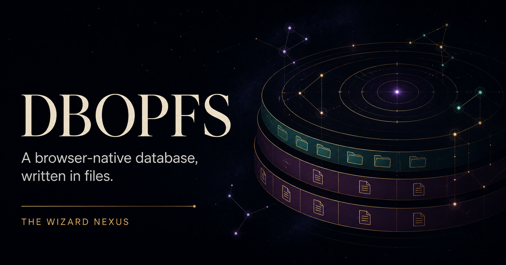
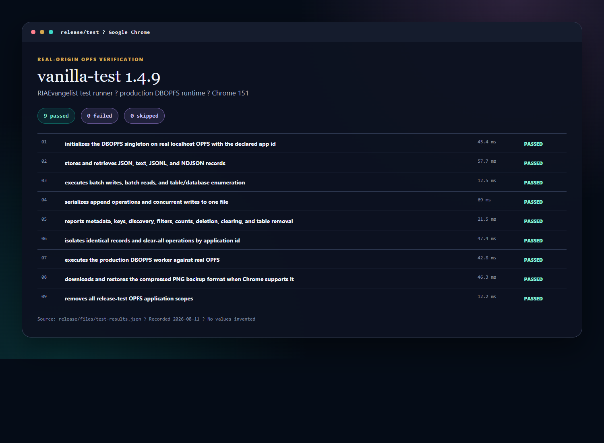
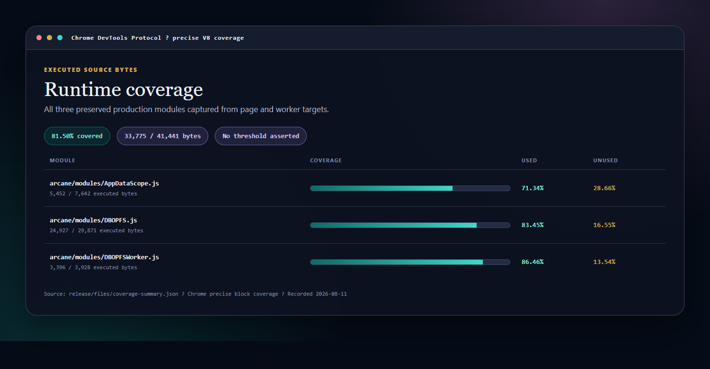

<p align="center">
  
</p>

# DBOPFS

[](https://thewizardnexus.github.io/DBOPFS/status.html)
[](https://thewizardnexus.github.io/DBOPFS/status.html)
[](https://github.com/TheWizardNexus/DBOPFS/releases/tag/v1.0.0)
[](LICENSE)

DBOPFS is a browser-native database built directly on the [Origin Private File System](https://developer.mozilla.org/en-US/docs/Web/API/File_System_API/Origin_private_file_system). Tables are directories, records are files, and application data stays in the browser unless the application exports it.

This `1.0.0` package preserves the production ARCANE OS runtime byte-for-byte. Its surrounding package, release tests, coverage evidence, licensing, and documentation are new; the three implementation files are unchanged.

[Read the documentation](https://thewizardnexus.github.io/DBOPFS/) · [Open the playground](https://thewizardnexus.github.io/DBOPFS/playground/) · [Review release evidence](https://thewizardnexus.github.io/DBOPFS/status.html)

## Install

```sh
npm install dbopfs@1.0.0
```

DBOPFS is a browser-only ESM module. Serve it over HTTPS or localhost; do not import it during Node.js server-side rendering.

Declare a stable application ID before loading the module:

```html
<meta name="arcane-app-id" content="my-app">
<script type="module">
  import '/node_modules/dbopfs/arcane/modules/DBOPFS.js';

  await window.dbopfs.readyPromise;

  await window.dbopfs.set('users', 'alex.json', {
    email: 'alex@example.com',
    role: 'admin'
  });

  const alex = await window.dbopfs.get('users', 'alex.json');
  console.log(alex);
</script>
```

With a browser-aware bundler or import map, the package root exports the same default `DBOPFS` class:

```js
import DBOPFS from 'dbopfs';

const db = window.dbopfs || new DBOPFS({applicationId: 'my-app'});
await db.readyPromise;
```

Use a `.json` key when you want `get()` to parse an object. Plain-text keys return strings; `.jsonl` and `.ndjson` keys return parsed row arrays.

## Core model

```text
OPFS root/
└── apps/
    └── my-app/
        ├── users/
        │   └── alex.json
        ├── documents/
        └── memory/
```

### Application folders and same-origin apps

An application ID stores records under `apps/<application-id>`. This helps prevent accidental reads, restores, or clears between trusted apps that share one browser origin (the same protocol, host, and port). Common examples are test apps at `example.com/app-a` and `example.com/app-b`, or several apps served from one intranet or extranet host without subdomains.

The folder is an organizational boundary, not a security boundary. A hostile or compromised script running on the same origin can bypass DBOPFS and request the browser's raw storage APIs. If applications do not trust one another or require isolated databases, host them on separate origins—normally separate domains or subdomains—or run them in separate browser profiles.

Trusted apps can deliberately share a browser-local database by using the same application ID and agreeing on the same tables and data formats. An app can also download validated seed data from a server and write it locally, or implement authenticated synchronization across browsers, devices, and machines. DBOPFS 1.0.0 does not provide the server, authentication, authorization, encryption, conflict handling, or sync protocol; those parts must be built for the application's security needs. Built-in preload or synchronization support may be considered in a future release if there is enough interest.

[Arcane OS](https://thewizardnexus.github.io/ARCANE-OS/) already supports DBOPFS database export/import and packaged database prepopulation. See the [application-scoping architecture guide](https://thewizardnexus.github.io/DBOPFS/architecture.html#security) for diagrams and deployment guidance.

## Readiness

The race-safe path is the singleton promise:

```js
await window.dbopfs.readyPromise;
```

The module also dispatches `dbopfs-ready` with `{dbopfs, applicationId, storagePath}`:

```js
window.addEventListener('dbopfs-ready', ({detail}) => {
  console.log(detail.applicationId, detail.storagePath);
});
```

## API at a glance

| Area | Members |
| --- | --- |
| State | `ready`, `readyPromise`, `applicationId`, `storagePath`, `tables` |
| Records | `set`, `get`, `delete`, `setMany`, `getMany`, `deleteMany` |
| Tables | `getTableHandle`, `getAll`, `clear`, `deleteTable`, `getTableNames` |
| Discovery | `getAllKeys`, `filterKeyIncludes`, `hasKey`, `count` |
| Raw files | `writeFile`, `readFile`, `getFileMetadata` |
| Lifecycle | `clearAllStorage`, `downloadCompressedPNG`, `restoreFromPNG` |

The [API reference](https://thewizardnexus.github.io/DBOPFS/api.html) documents signatures, return values, cache behavior, and existing error semantics.

The `tables` property is a page-local in-memory cache: it belongs only to the current loaded page, is not durable storage, and is not automatically refreshed when another tab or script changes OPFS. Read the [cache guide](https://thewizardnexus.github.io/DBOPFS/guides.html#cache) before relying on cached reads.

Storage methods are asynchronous and return promises. The [async patterns guide](https://thewizardnexus.github.io/DBOPFS/async.html) explains when to await immediately, when to start independent work and await it later, and why `await` gives sequencing rather than a multi-record transaction.

## ARCANE OS migration

The package intentionally keeps this layout:

```text
node_modules/dbopfs/
├── arcane/modules/
│   ├── AppDataScope.js
│   ├── DBOPFS.js
│   └── DBOPFSWorker.js
└── node_modules/strong-type/
```

An ARCANE installation can redirect its DBOPFS module mount or import pointer from the in-tree `arcane/modules` source to `node_modules/dbopfs/arcane/modules`. The worker and application-scope module remain adjacent, and the relative `strong-type` import remains valid because that dependency is bundled. Existing DBOPFS call sites do not need API changes.

The release test installs the packed tarball into a clean consumer fixture and verifies this exact layout before publication.

## Tests and coverage

Release tests use [`vanilla-test@1.4.9`](https://github.com/RIAEvangelist/vanilla-test) in Google Chrome against real OPFS on localhost. Chrome precise coverage is captured for the three runtime modules. Release tests do not run in GitHub Actions; the repository's Pages-only workflow deploys the documentation. Badges are generated from the final release evidence committed under `release/`.

<p>
  <a href="https://thewizardnexus.github.io/DBOPFS/status.html#screenshots"></a>
  <a href="https://thewizardnexus.github.io/DBOPFS/status.html#screenshots"></a>
</p>

```sh
npm ci
npm run release:test
```

## Browser support and limitations

- Requires a secure context and `navigator.storage.getDirectory()`.
- Uses a dedicated worker when synchronous OPFS access is needed.
- Requests persistent storage when the browser supports it; the browser may decline.
- Browser storage quotas, eviction rules, and backup APIs vary by browser.
- Importing in Node.js or SSR without browser globals is unsupported.
- Existing implementation behavior is documented rather than silently changed for `1.0.0`.

## License

Noncommercial use is licensed under [PolyForm Noncommercial 1.0.0](LICENSE). This is source-available software, not OSI open source.

A separate paid commercial license is available for a nominal fee; see [COMMERCIAL-LICENSE.md](COMMERCIAL-LICENSE.md). Downloading the package does not grant commercial rights.

Redistributors must preserve the license terms or official license URL and every exact `Required Notice:` line in [NOTICE](NOTICE), as required by PolyForm's Notices clause.

Source identity and hashes are recorded in [SOURCE_PROVENANCE.md](SOURCE_PROVENANCE.md). Third-party terms are listed in [THIRD_PARTY_NOTICES.md](THIRD_PARTY_NOTICES.md).
